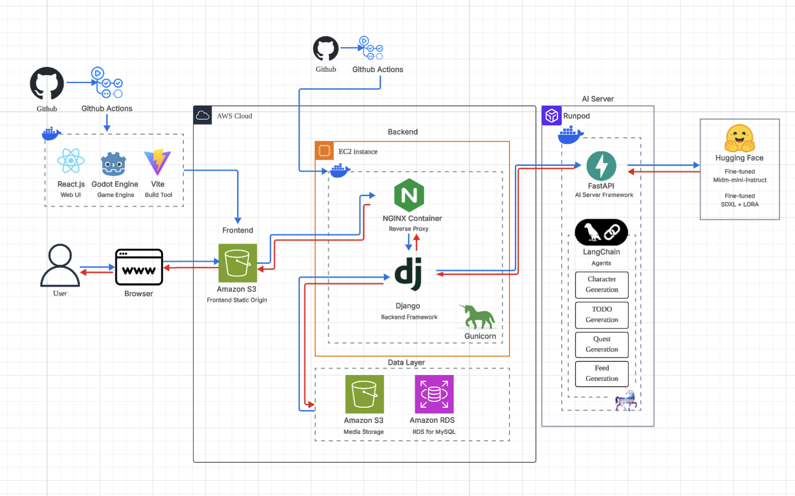
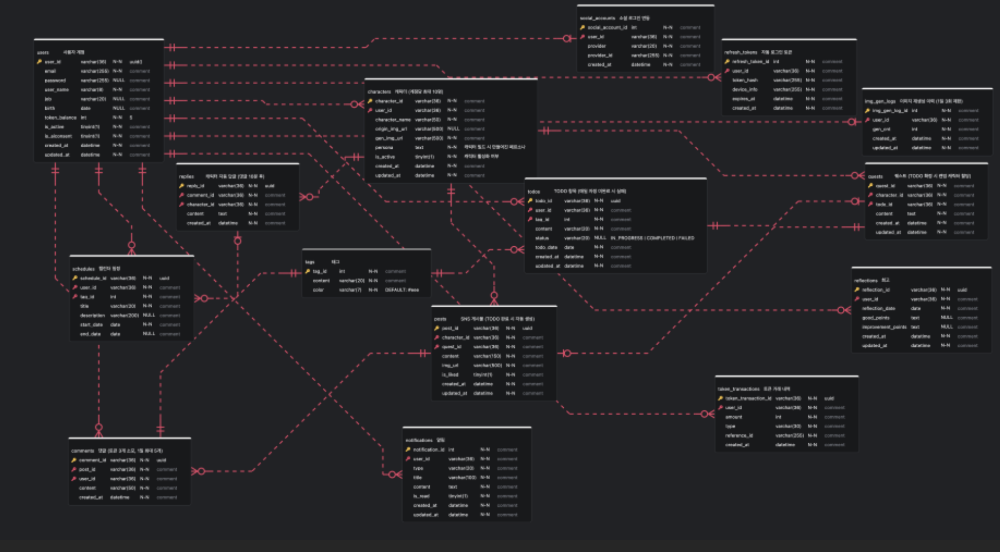

# SKN24-FINAL-4TEAM

 

# 내일도와줘! 몽글마을

> AI 애착인형 페르소나 활용 LLM To-do Gamification 서비스
> 내 **애착인형**이 캐릭터가 되어, 할 일을 지속적으로 도와주는 **감성형 루틴 관리 서비스** 

---

## 팀원

| 이름   | github                        |
| ------ | ----------------------------- |
| 임정희 | https://github.com/bigmooon   |
| 박영훈 | https://github.com/aprkaos56  |
| 정석원 | https://github.com/JeongSW123 |
| 조아름 | https://github.com/areum117   |
| 최하진 | https://github.com/hun6684    |

---

## 목차

1. [개요](#개요)
2. [주요 기능](#주요-기능)
3. [시스템 아키텍처](#시스템-아키텍처)
4. [ERD](#ERD)
5. [활용 데이터](#활용-데이터)
6. [모델 선정](#모델-선정)
7. [파인튜닝 및 평가](#파인튜닝-및-평가)
6. [플레이 영상](#플레이-영)
6. [비즈니스 모델(BM)](#비즈니스-모델(BM))
6. [기대 효과](#기대-효과)
6. [향후 발전 방향](#향후-발전-방향)

---

## 개요

### 배경 및 시장 현황

최근 MZ세대를 중심으로 건강 관리, 자기계발, 생활 습관 형성 등 일상 속 자기관리에 대한 관심이 높아지고 있다. 실제로 루틴 형성 앱을 이용하는 비율은 **21.3%**로 나타났으며, 정해진 목표를 반복적으로 실천하고 자신의 생활을 체계적으로 관리하려는 수요가 지속적으로 증가하고 있다.

 

| 루틴을 실천하는 이유                                                      | 루틴 실천현황                                               |
| ------------------------------------------------------------------------- | ----------------------------------------------------------- |
|  |  |

이러한 변화에 따라 일정 관리, 할 일 관리, 집중 시간 측정 등의 기능을 제공하는 생산성 서비스 시장 역시 성장하고 있다. 글로벌 생산성 앱 시장은 2025년 약 119억 달러 규모로 성장했으며, 이후에도 연평균 8.63%의 성장세를 이어갈 것으로 전망된다.

 

| 생산성 시장                                             |
| ------------------------------------------------------- |
|  |

 

### 문제 정의

자기계발에 관심을 가지고 있음에도 실제 행동으로 옮기지 못하는 사용자가 많다. 자기계발을 실천하지 못하는 주요 원인으로는 귀찮음 25.8%, 무엇을 해야 할지 모름 24.4%, 시간 부족 21.7% 등이 나타났다.

이는 사용자가 목표를 가지고 있더라도 이를 구체적인 행동 단위로 나누거나, 현실적으로 실행 가능한 계획을 수립하는 과정에서 어려움을 겪고 있음을 보여준다.

 

| 자기개발 현황                                               | 생산성 앱 이탈율                              |
| ----------------------------------------------------------- | --------------------------------------------- |
|  |  |

기존 생산성 앱의 낮은 이용 지속률 또한 중요한 문제이다. 생산성 앱의 초기 리텐션율은 **32.86%**이지만, 30일 이후에는 **9.63%**까지 급격히 감소한다. 많은 서비스가 할 일을 기록하고 완료 여부를 확인하는 기능에 집중하고 있어, 사용자가 반복적으로 서비스를 방문하고 목표를 이어가도록 만드는 정서적·외적 동기 부여가 충분하지 않기 때문이다.

따라서 단순히 일정을 기록하는 기능을 넘어, 사용자의 막연한 목표를 구체적인 행동으로 변환하고 실천 과정에서 지속적인 보상과 피드백을 제공하는 새로운 형태의 루틴 관리 서비스가 필요하다.

 

### 서비스 필요성

몽글마을은 기존 생산성 앱의 낮은 지속성과 단순한 기록 중심 구조를 개선하기 위해, AI 기반 계획 수립과 캐릭터 중심의 게임화 요소를 결합한 감성형 루틴 관리 서비스이다.

| 키덜트 시장                                       |
| ------------------------------------------------- |
|  |

사용자는 자신의 애착인형 사진을 업로드하여 나만의 AI 캐릭터를 생성할 수 있다. 이렇게 만들어진 캐릭터는 단순한 아바타가 아니라 사용자의 할 일을 함께 수행하고, 진행 상황에 따라 응원과 피드백을 제공하는 일상의 동반자로 활용된다.

특히 캐릭터와 아바타에 친숙한 2030 세대와 성장하고 있는 키덜트 시장의 특성을 반영하여, 생산성 관리에 시각적 몰입감과 정서적 유대감을 더하고자 했다.

몽글마을은 다음 네 가지 방식으로 사용자의 지속적인 실천을 지원한다.

1. **행동 변화 설계**
     사용자가 자연어로 입력한 목표를 AI가 실행 가능한 TODO로 분해하고, 각 TODO를 캐릭터의 퀘스트로 연결하여 계획 수립과 시작에 대한 부담을 줄인다.

2. **개인화된 AI 캐릭터**
     사용자의 애착인형 사진과 성격 키워드를 기반으로 32비트 픽셀 캐릭터와 페르소나를 생성하여 사용자별로 개인화된 경험을 제공한다.

3. **게임화 기반 보상 구조**
     TODO를 완료하면 사과 토큰을 지급하고, SNS 피드 생성과 마을 커스터마이징 기능으로 연결하여 반복적인 참여와 서비스 재방문을 유도한다.

4. **정서적 피드백 제공**
     캐릭터의 성격과 말투를 반영한 응원 메시지와 피드백을 제공하여 사용자가 캐릭터와 함께 목표를 수행하고 있다는 경험을 제공한다.

 

## 목적

몽글마을의 목적은 사용자가 계획을 세우는 과정에서 느끼는 부담을 줄이고, 목표를 지속적으로 실천할 수 있는 환경을 제공하는 것이다.

사용자가 “토익 공부하기”, “운동 시작하기”와 같이 막연한 목표를 입력하면, LLM이 목표를 구체적이고 실행 가능한 TODO로 분해한다. 장기간의 계획이 필요한 경우에는 챗봇과의 대화를 통해 사용자의 일정과 목표를 확인하고, 일자별 플랜을 자동으로 생성한다.

생성된 TODO에는 사용자의 캐릭터가 퀘스트 형태로 연결된다. 사용자가 퀘스트를 완료하면 사과 토큰을 획득하고, 캐릭터의 페르소나가 반영된 이미지와 게시글이 SNS 피드에 자동으로 생성된다. 획득한 토큰은 캐릭터 게시물의 댓글 작성 및 캐릭터의 집과 마을을 꾸미는 데 사용할 수 있어, 목표 달성의 결과가 서비스 내 시각적 변화로 이어지도록 설계하였다.

이를 통해 몽글마을은 다음과 같은 사용자 경험을 제공하고자 한다.

- 자연어로 입력한 목표를 실행 가능한 TODO로 변환하여 **계획 수립과 시작에 대한 부담을 완화한다.**
- TODO 완료에 따른 보상과 콘텐츠 생성을 통해 **지속적인 실천 동기를 제공한다.**
- 사용자의 애착인형을 기반으로 생성된 AI 캐릭터와의 상호작용을 통해 **정서적 유대감과 몰입감을 형성한다.**
- 계획 수립, 집중, 완료, 보상, 회고로 이어지는 선순환 구조를 통해 **일상 속 루틴 형성을 지원한다.**

 

### 주요 고객

몽글마을의 주요 고객은 자기관리와 자기계발에 대한 의지는 있지만, 구체적인 계획을 세우거나 이를 장기간 지속하는 데 어려움을 겪는 2030 사용자이다.

특히 기존 TODO 앱을 사용해 보았지만 단순한 기록 방식에 흥미를 잃고 이탈한 경험이 있는 사용자, 캐릭터·아바타·꾸미기·게임형 보상 요소에 친숙한 사용자, 자신만의 캐릭터와 함께 목표를 달성하는 감성적인 경험을 선호하는 사용자를 주요 대상으로 한다.

몽글마을은 생산성 도구의 실용성과 캐릭터 서비스의 재미를 결합하여, 사용자가 해야 할 일을 단순히 관리하는 것을 넘어 즐겁고 지속 가능한 일상의 루틴으로 만들어 나갈 수 있도록 지원한다.

---

## 주요 기능

| 기능 | 설명 |
| --- | --- |
| **AI 캐릭터 생성** | 애착인형 사진 + 키워드 → 32bit 픽셀 캐릭터 + 페르소나 (계정당 10명) |
| **자연어 TODO 분해** | 자연어를 입력한 간단한 TODO 분류 → 일자별 TODO 자동 생성 |
| **장기 플랜 생성** | 챗봇 형식으로 장기간의 플랜 설계 → 일자별 플랜 자동 생성 |
| **퀘스트 자동 연결** | TODO에 캐릭터 1:1 매핑, 완료 시 캐릭터 페르소나 반응 제공 |
| **SNS 피드** | 퀘스트 완료 시 캐릭터 페르소나를 반영한 글 + 이미지 자동 게시 |
| **포모도로 집중 모드** | 25분 집중 / 5분 휴식 전환 시 캐릭터 페르소나 메시지 |
| **마을 커스터마이징** | 사과 토큰으로 캐릭터 집 꾸미기 |
| **회고** | 일일 “잘한 점/아쉬운 점” 기록, 캐릭터가 회고 유도 |

---

## 시스템 아키텍처
 
[시스템 아키텍처](https://drive.google.com/file/d/15p49ZUIrJCmrSCy3LpU3FbjapZaMXdRc/view?usp=share_link)

---

## ERD

[ERD 및 테이블 명세서](https://drive.google.com/file/d/1PevvUKy8Mx8ltC6oueXnY-aVUMJEuqm8/view?usp=share_link)

---

## 활용 데이터

---

## 모델 선정

---

## 파인튜닝 및 평가

---

## 플레이 영상

---

## 비즈니스 모델(BM)

---

## 기대 효과

---

## 향후 발전 방
