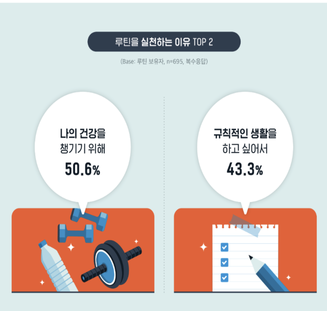
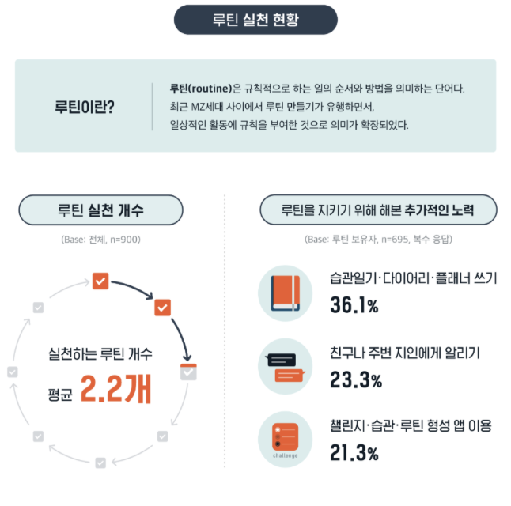
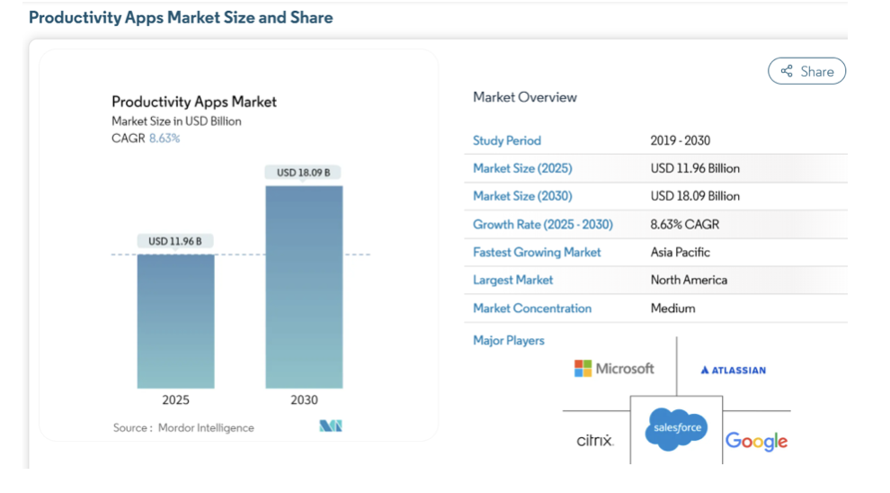
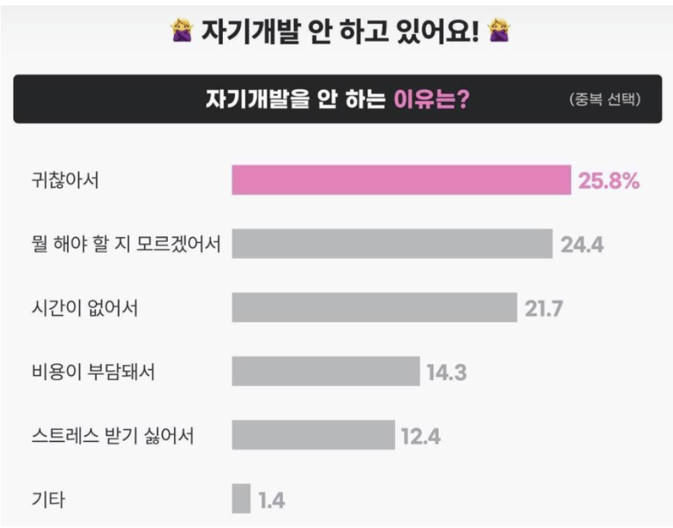
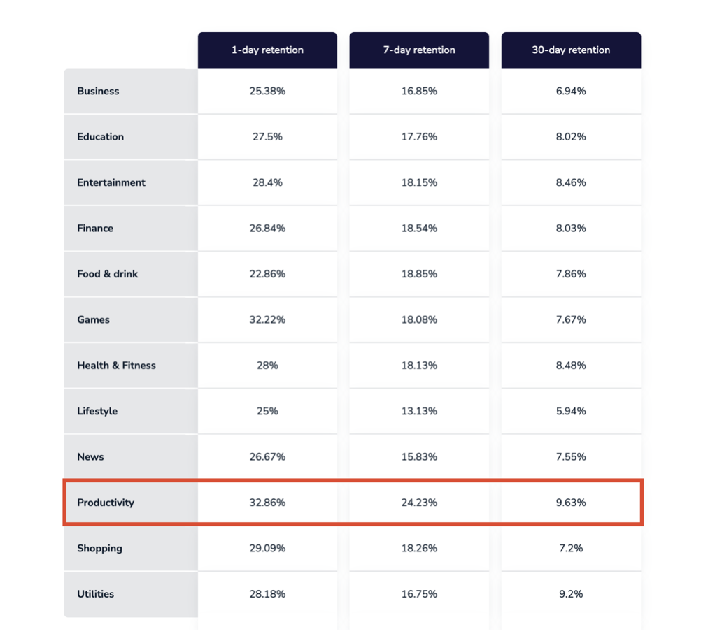
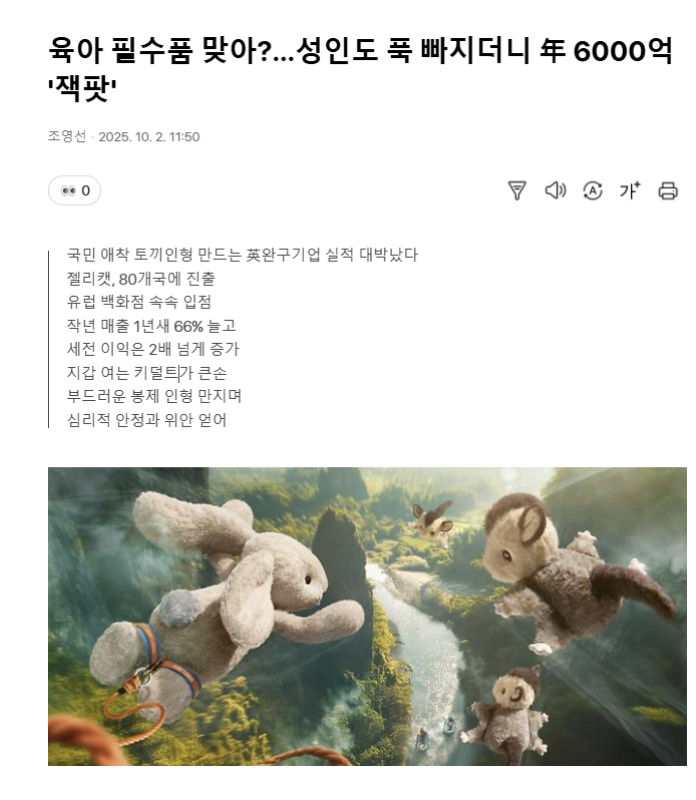

# SKN24-FINAL-4TEAM

# 내일도와줘! 몽글마을

> AI 애착인형 페르소나 활용 LLM To-do Gamification 서비스
> 내 **애착인형**이 캔릭터가 되어, 할 일을 지속적으로 도와주는 **감성형 루틴 관리 서비스**

---

## 팀원

| 이름   | github                        |
| ------ | ----------------------------- |
| 임정희 | https://github.com/bigmooon   |
| 박영훈 | https://github.com/aprkaos56  |
| 정석원 | https://github.com/JeongSW123 |
| 조아름 | https://github.com/areum117   |
| 최하진 | https://github.com/hun6684    |

---

## 목차

1. [개요](#1-개요)
2. [포지셔닝](#2-포지셔닝)
3. [서비스 흐름](#3-서비스-흐름)
4. [기술 스택 · 모델 선정](#4-기술-스택--모델-선정)
5. [AI 에이전트 4종](#5-ai-에이전트-4종)
6. [한계와 To-be](#6-한계와-to-be)

---

## 개요

### 배경 & 시장

| 루틴을 실천하는 이유                                                      | 루틴 실천현황                                               |
| ------------------------------------------------------------------------- | ----------------------------------------------------------- |
|  |  |

- MZ세대의 자기관리 관심 증가 — 루틴 형성 앱 이용률 **21.3%**
- 글로벌 생산성 앱 시장: 2025년 **119억 달러**, 연 8.63% 성장 전망

| 생산성 시장                                             |
| ------------------------------------------------------- |
|  |

### 문제 정의

| 자기개발 현황                                               | 생산성 앱 이탈율                              |
| ----------------------------------------------------------- | --------------------------------------------- |
|  |  |

- 자기개발 미실천 이유: 귀찮음(25.8%), 뭘 해야 할지 모름(24.4%), 시간 부족(21.7%)
- 생산성 앱 30일 리텐션율 **9.63%** — 설치 초기(32.86%) 대비 급락
- 근본 원인: 지속적 동기 부여 구조의 부재

### 필요성

| 키덜트 시장                                       |
| ------------------------------------------------- |
|  |

1. **행동 변화 설계**: To-do를 캐릭터 퀘스트로 분해 + 사과 토큰·SNS 피드·마을 커스터마이징 보상
2. **개인화 AI 캐릭터**: 애착인형 사진을 AI로 변환, 시각적 몰입감 제공 (키덜트 시장 성장 부합)
3. **게임화**: 포인트·보상·진행 상황 시각화로 반복 재방문 유도
4. **감정적 피드백**: LLM 기반 AI가 페르소나에 맞는 응원 메시지로 정서적 지원

## 목적

- **시작 부담 완화**: 자연어 입력 → LLM이 실행 가능한 TODO로 분해 + 캐릭터 퀘스트로 자동 연결
- **지속 동기 제공**: TODO 완료 → 사과 토큰 지급 → SNS 피드 자동 생성 → 마을 커스터마이징
- **정서적 유대 형성**: 나만의 AI 캐릭터가 페르소나에 맞는 응원·피드백을 제공하는 일상의 동반자

### 주요 고객

- 20~30대, 자기관리 의지는 있지만 계획 수립·지속 실천에 어려움을 겪는 사용자
- 기존 TODO 앱에 흥미를 잃고 이탈한 경험이 있는 사용자
- 캐릭터·아바타·게임형 보상 요소에 친숙한 사용자

### 주요 기능

| 기능 | 설명 |
| --- | --- |
| **AI 캐릭터 생성** | 애착인형 사진 + 키워드 → 8bit 픽셀 캐릭터 + 페르소나 (계정당 10명) |
| **자연어 TODO 분해** | 싱글턴(즉시) / 멀티턴(챗봇 대화)으로 목표 → 일자별 TODO 자동 생성 |
| **퀘스트 자동 연결** | TODO에 캐릭터 1:1 매핑, 완료 시 캐릭터 페르소나 반응 제공 |
| **SNS 피드** | 퀘스트 완료 시 캐릭터 수행 이미지 + 140자 캡션 자동 게시 |
| **포모도로 집중 모드** | 25분 집중 / 휴식 전환 시 캐릭터 페르소나 메시지 |
| **마을 커스터마이징** | 사과 토큰으로 캐릭터 집·마당 꾸미기 — 실천이 마을 성장으로 누적 |
| **회고** | 일일 “잘한 점/못한 점” 기록, 캐릭터가 회고 유도 |
