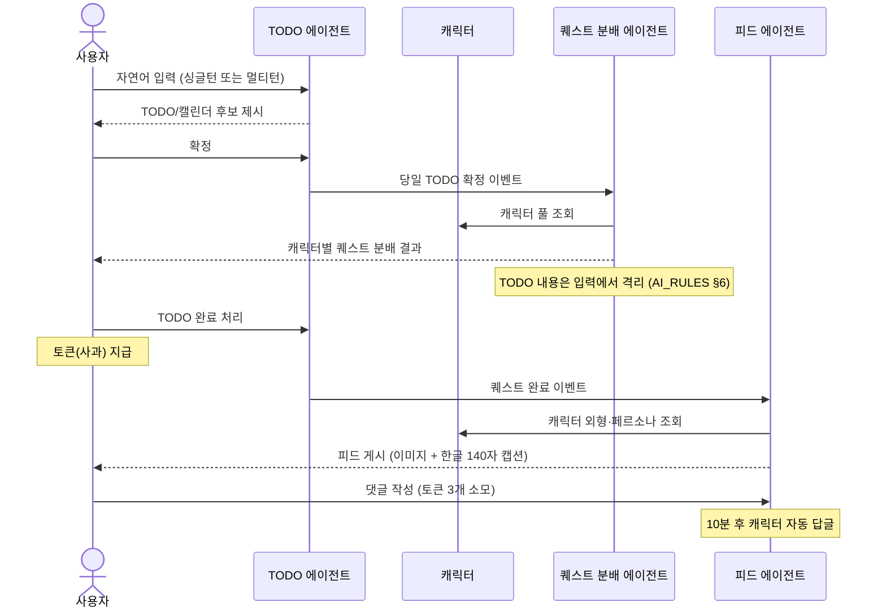

# FEATURES

> **몽글마을 — 피처 인덱스 + 공통 설계 패턴 + 완성 정의**
>
> 본 문서는 피처 목록을 한눈에 보여주고, 피처 간 데이터 흐름과 공통 패턴, 완성 기준을 정의한다.
> 피처별 상세 설계는 `docs/features/{feature}/CLAUDE.md` 참조.

---

## 1. 피처 맵

| 피처 | 트리거 | 입력 | 출력 | 상태 | DATA_MODEL | 상세 |
|---|---|---|---|---|---|---|
| character_generation | 사용자 "캐릭터 만들기" 요청 | persona·name·키워드·(이미지) | 캐릭터 엔티티 + S3 이미지 | 설계됨 | §2, §6.3 | [docs](./features/character_generation/CLAUDE.md) |
| todo (싱글턴) | 사용자 프롬프트 입력 | prompt (≤200자) | TODO/캘린더 후보 → 사용자 확정 | 설계됨 | §3 | [docs](./features/todo/CLAUDE.md) |
| todo (멀티턴) | 사용자 챗봇 메시지 | message (≤600자) + session_id | 일자별 플랜 + 태그 | 설계됨 | §3 | [docs](./features/todo/CLAUDE.md) |
| quest_generation | 당일 TODO 확정 이벤트 | TodoRef[] + Character[] + 남은 일일 한도 | 캐릭터-퀘스트 매핑 결과 | 구현중 | §2, §3.2 | [docs](./features/quest_generation/CLAUDE.md) |
| feed_generation | 퀘스트 수행 완료 이벤트 | Quest + Character | 이미지 + 한글 140자 캡션 | 설계됨 | §2, §4 | [docs](./features/feed_generation/CLAUDE.md) |

상태 정의: **설계됨** = 본 폴더 문서만 존재 / **구현중** = 코드 진행 중 / **완성** = DoD 필수 5항목 통과 (§4 참조)

## 2. 피처 간 데이터 플로우



세부 트리거·이벤트 경로는 피처별 `CLAUDE.md` §1 참조.

## 3. 공통 설계 패턴

### 3.1 I/O 계약 (Pydantic)

모든 피처는 입력/출력/중간 산출물을 분리된 Pydantic 모델로 정의한다.

```python
class FeatureInput(BaseModel):
    ...

class IntermediateResult(BaseModel):
    ...

class FeatureOutput(BaseModel):
    ...
```

피처 폴더 내 `schemas.py` 에 모두 둔다. 입력은 진입점(API/이벤트 핸들러)에서 검증.

### 3.2 에이전트 vs 호출자 책임 분리

`quest_generation` 과 `feed_generation` 이 채택한 패턴이며, 본 프로젝트의 표준이다.

| 책임 | 에이전트 | 호출자 |
|---|---|---|
| 입력 검증 (도메인 규칙) | ✅ | — |
| 외부 모델 호출 (LLM·VLM) | ✅ | — |
| 비즈니스 출력 생성 | ✅ | — |
| 카운터 저장·증감 | — | ✅ |
| DB 영속화 | — | ✅ |
| 이벤트 발행 | — | ✅ |
| 실패 항목 재처리 큐 | — | ✅ |

원칙: **에이전트는 입력을 받아 결과를 반환하는 순수 함수에 가깝게.** 외부 상태는 호출자가 관리.

### 3.3 표준 파이프라인 순서

```
Validation → 외부 호출 (LLM/VLM/S3) → 빌드 (도메인 객체 조립) → 영속화 (호출자 위임)
```

각 단계는 별도 모듈로 분리. 실패 시 후속 단계 미진입.

### 3.4 디렉토리 레이아웃 컨벤션

```
agents/{feature}/
├── __init__.py
├── pipeline.py        # 오케스트레이션 entry point
├── validation.py
├── nodes/             # 단계별 노드
│   └── ...
├── repository.py      # DB I/O (호출자 측에서 주입받을 수 있음)
├── schemas.py         # Pydantic 모델
└── exceptions.py
```

복잡한 피처(`todo`)는 `single_turn/`, `multi_turn/`, `commit/` 같은 하위 폴더로 분리. 자세한 예는 각 피처 `CLAUDE.md` §6.1 참조.

## 4. 완성 정의 (Definition of Done)

피처가 "완성"되었다고 선언하려면 아래 **필수 5항목**을 모두 통과해야 한다.

1. **테스트 통과** — 단위 + 통합 테스트 모두 통과 (커버리지 80%+ 권장, 글로벌 `~/.claude/rules/testing.md` 참조)
2. **architecture.mmd as-built 갱신** — `docs/features/{feature}/architecture.mmd` 가 실제 구현된 플로우를 반영함 (설계 시점 그대로 두지 않는다)
3. **CHANGELOG.md 항목 추가** — `CHANGELOG.md` `[Unreleased]` 또는 새 날짜 섹션에 `### Added` / `### Changed` 항목 등록
4. **피처 `CLAUDE.md` "미결 사항" 해소** — 해당 피처 문서의 "미결 사항" 섹션이 모두 결정·반영되었거나 별도 이슈/문서로 이관됨
5. **인덱스 갱신** — 다음 세 곳을 모두 반영:
   - `docs/FEATURES.md` §1 피처 맵의 "상태" 컬럼 (`설계됨` → `구현중` → `완성`)
   - 신규 피처라면 `CLAUDE.md` 라우팅 표에 행 추가
   - `docs/FEATURES.md` §2 시퀀스 다이어그램이 새 흐름을 반영

**선택:**

6. `docs/TODO.md` 완료 항목 1줄 기록 — 내부적으로 중요한 결정이 있었던 경우

**검증 체크리스트** (PR/리뷰 시 확인):

```
[ ] 1. 테스트 통과
[ ] 2. architecture.mmd 갱신 (이번 PR에 diff 포함)
[ ] 3. CHANGELOG.md 항목 추가
[ ] 4. 피처 CLAUDE.md "미결 사항" 정리
[ ] 5. 인덱스 갱신 (FEATURES §1 상태 컬럼 + CLAUDE.md 라우팅 표 + FEATURES §2 시퀀스)
[ ] 6. (선택) docs/TODO.md 기록
```

## 5. 피처별 요약

### 5.1 character_generation

사용자가 업로드한 이미지 또는 텍스트(페르소나·키워드)로 8bit 픽셀 정면 캐릭터 이미지와 메타데이터(성격·말투·배경)를 생성한다. 텍스트만 또는 이미지+텍스트 두 경로를 지원하며, 이미지 경로는 VLM 으로 외형 특징을 추출한 뒤 이미지 생성 단계에 전달한다. 계정당 10명·일 3회 재생성 한도. 상세: [features/character_generation/CLAUDE.md](./features/character_generation/CLAUDE.md).

### 5.2 todo

싱글턴(한 번의 프롬프트로 task 분할)과 멀티턴(챗봇과 대화로 장기 플랜 구체화) 두 모드를 제공한다. 두 모드 모두 최종 저장 디스패처를 거치며, 당일 TODO 확정 시 퀘스트 분배 에이전트가 트리거된다. 멀티턴은 정보 충분성 판단 → 꼬리 질문 → 플랜 생성 → 태그 부여의 단계로 동작한다. 상세: [features/todo/CLAUDE.md](./features/todo/CLAUDE.md).

### 5.3 quest_generation

당일 확정된 TODO 와 보유 캐릭터를 입력받아 1:1:1 매핑(TODO ↔ 퀘스트 ↔ 캐릭터)을 생성한다. 같은 라운드 내 캐릭터 중복 금지·라운드 소진 시 풀 리셋 로직을 가진다. **퀘스트 텍스트는 TODO 내용과 무관**하며(AI_RULES §6 격리), 캐릭터 페르소나/외형 기반으로 생성된다. 일 5회 한도는 호출자가 관리. 상세: [features/quest_generation/CLAUDE.md](./features/quest_generation/CLAUDE.md).

### 5.4 feed_generation

퀘스트 수행 완료 시점에 캐릭터가 퀘스트를 수행하는 모습의 이미지(VLM)와 캐릭터 말투로 작성된 한글 140자 캡션(LLM)을 함께 생성한다. 캡션은 이미지 정보를 반영하므로 VLM → LLM 직렬 의존. 이미지의 영구 저장과 DB 영속화는 호출자 책임. 상세: [features/feed_generation/CLAUDE.md](./features/feed_generation/CLAUDE.md).

---

## 6. 관련 문서

- 제품 컨텍스트: [`./PRODUCT_SPEC.md`](./PRODUCT_SPEC.md)
- 런타임 AI 규칙: [`./AI_RULES.md`](./AI_RULES.md)
- DB 스키마: [`./DATA_MODEL.md`](./DATA_MODEL.md)
- 라우팅 허브: [`../CLAUDE.md`](../CLAUDE.md)
- 팀 공유 변경 로그: [`../CHANGELOG.md`](../CHANGELOG.md)
