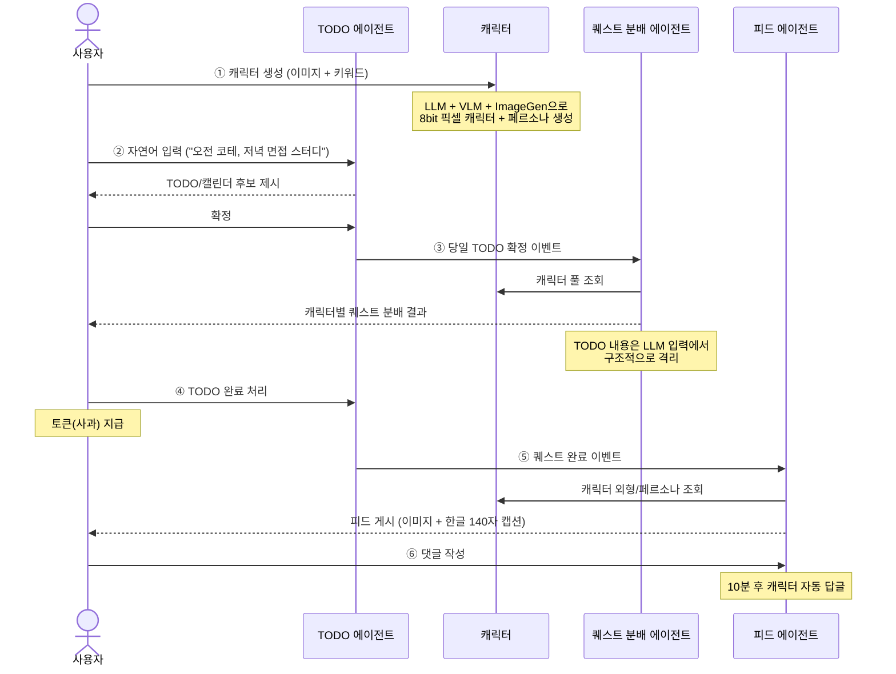
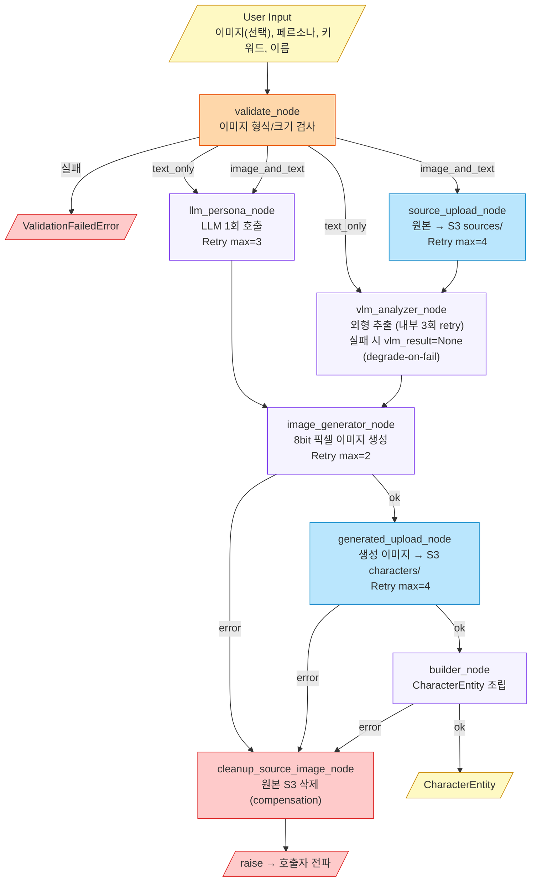
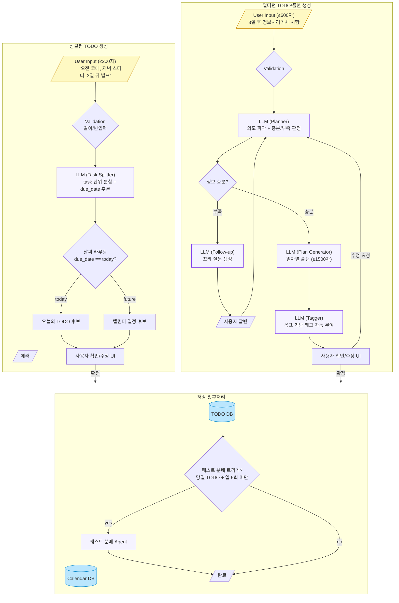
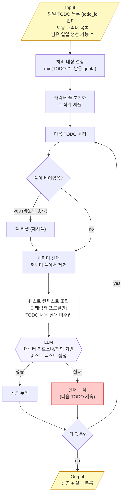
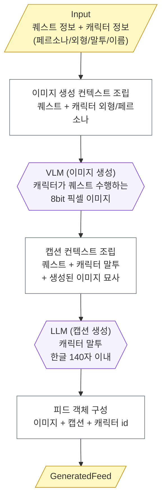

# 내일도와줘, 몽글마을

> **AI 애착인형 페르소나 활용 LLM To-do Gamification 서비스**
>
> _"할 일은 차갑지만, 캐릭터는 따뜻하다."_
>
> 사용자의 애착인형이 8bit 픽셀 캐릭터로 다시 태어나,
> 매일의 TODO를 캐릭터의 퀘스트로 바꾸어 작은 성취감을 쌓는 라이프스타일 앱.

**SK네트웍스 Family AI 과정 24기 4팀**
임정희 · 박영훈 · 정석원 · 조아름 · 최하진

---

## 목차

1. [시장 조사 — 왜 또 TODO 앱인가?](#1-시장-조사--왜-또-todo-앱인가)
2. [포지셔닝 — 몽글마을은 어디에 서 있나](#2-포지셔닝--몽글마을은-어디에-서-있나)
3. [프로덕트 소개 — 전체 프로세스](#3-프로덕트-소개--전체-프로세스)
4. [기술 스택](#4-기술-스택)
5. [데모 이미지](#5-데모-이미지)
6. [Feature Architecture — 4개의 AI 에이전트](#6-feature-architecture--4개의-ai-에이전트)
   - 6.1 [Character Creation — 캐릭터 생성 파이프라인](#61-character-creation--캐릭터-생성-파이프라인)
   - 6.2 [TODO Creation — 자연어를 할 일로 바꾸는 두 갈래 길](#62-todo-creation--자연어를-할-일로-바꾸는-두-갈래-길)
   - 6.3 [Quest Generation — TODO와 퀘스트의 의미적 분리](#63-quest-generation--todo와-퀘스트의-의미적-분리)
   - 6.4 [Feed Generation — 캐릭터가 만들어내는 일상의 SNS](#64-feed-generation--캐릭터가-만들어내는-일상의-sns)

---

# 1. 시장 조사 — 왜 또 TODO 앱인가?

## 1.1 MZ세대는 이미 "자기관리 시대" 를 살고 있다

자기관리·자기개발에 대한 관심은 트렌드가 아니라 일상이 되었다.

- **대학내일20대연구소**: 작은 습관으로 일상을 가꾸고 성취감을 얻는 MZ세대를 **"일상력 챌린저"** 로 정의 — 자기개발이 공부·지식을 넘어 신체 건강·취미·정신 건강 등 일상 전반의 관리로 확장. ¹
- 루틴 보유자들이 활용하는 방식 중 **"챌린지·습관·루틴 형성 앱 이용" 비율 21.3%** — 디지털 서비스에 대한 실제 수요가 존재. ²
- **잡플래닛**: 직장인 10명 중 **7명** 이 자기개발 중. 꾸준히 실천한 응답자들은 _"인생에 활력이 생긴다", "성취감 때문에 도전한다"_ 고 답함. ³

## 1.2 그런데 — 생산성 앱은 한 달 만에 1/3로 빠진다

> **OneSignal 데이터**: 생산성 앱의 **30일 리텐션율 9.63%** (설치 초기 32.86% → 한 달 만에 1/3 수준). ⁵

핵심 문제는 _의지 부족_ 이 아니라 **"쉽게 시작하고 반복적으로 성취감을 느끼게 해주는 구조의 부재"** 다.

지속 실패의 3가지 근본 원인:

1. **무감정성** — 체크박스를 누르는 행위 자체에 보상이 없다.
2. **외부성** — 앱이 _나의 일부_ 가 아니라 _남의 시스템_ 처럼 느껴진다.
3. **단방향성** — 사용자가 앱에 입력만 할 뿐, 앱이 사용자에게 _말을 걸어주지 않는다_.

## 1.3 시장은 성장하고 있다 + 새로운 소비 트렌드

- **Mordor Intelligence — Productivity Apps Market (2025~2030)**: 생산성 앱 시장은 지속 성장 중. ⁴
- **한국경제 보도**: 성인 인형(키덜트) 시장이 **연 6,000억 원** 규모로 성장 — 성인이 캐릭터/인형에 정서적 애착을 갖는 것은 더 이상 예외가 아닌 주류 소비. ⁸

> **두 트렌드의 교차점:** _자기관리 의지는 있지만 지속 못 하는 사용자_ × _캐릭터·인형에 정서적 의미를 두는 성인 소비자_ = **AI 캐릭터 기반 자기관리 서비스의 빈 자리**.

## 1.4 학술적으로도 근거가 있다

| 연구                                                                                                                    | 핵심 메시지                                                                                                       |
| ----------------------------------------------------------------------------------------------------------------------- | ----------------------------------------------------------------------------------------------------------------- |
| **PubMed** — Digital Behavior Change Intervention Designs for Habit Formation (Systematic Review) ⁶                     | 습관 형성 디지털 서비스의 핵심 설계 요소: **목표 설정 · 자기 모니터링 · 알림 · 행동 피드백 · 보상**               |
| **ScienceDirect** — Individualized gamification elements: The impact of avatar and feedback design on reuse intention ⁷ | **아바타 디자인과 피드백 방식** 이 사용자의 _유능감·자율성·관계성_ 을 충족시켜 서비스 재사용 의도에 유의미한 영향 |

즉 _"사용자가 직접 만든 캐릭터와 상호작용하며 목표를 수행하는 방식"_ 이 단순 텍스트 TODO 관리보다 장기 사용 동기 형성에 효과적이라는 학술적 근거가 존재한다.

## 1.5 기존 시장 정리

| 카테고리           | 대표 서비스                                         | 강점                       | 약점                                      |
| ------------------ | --------------------------------------------------- | -------------------------- | ----------------------------------------- |
| **전통적 TODO**    | Todoist, TickTick, Microsoft To Do                  | 강력한 일정 관리, 리마인더 | 무미건조 → 30일 리텐션 9.63%              |
| **노트 통합형**    | Notion, Obsidian                                    | 자유도 높음                | 진입장벽 ↑, 일상 루틴에 부적합            |
| **게이미피케이션** | **Habitica** ¹¹, **gogh** ¹², **Cram & Conquer** ¹³ | 동기부여 강함              | 캐릭터/세계관이 _주어진 것_, 내 것이 아님 |
| **AI 비서형**      | Motion, Reclaim.ai                                  | 자동 스케줄링              | B2B 위주, 감정적 연결 부재                |

---

# 2. 포지셔닝 — 몽글마을은 어디에 서 있나

## 2.1 좌표축

```
                 정서적 연결 강함
                       │
                       │        ● 내일도와줘, 몽글마을 (목표 좌표)
                       │
                       │
   무미건조 ───────────┼─────────── 게임/세계관 강함
                       │
                       │
   Todoist ●           │        ● Habitica
   Notion  ●           │        ● Cram & Conquer
   Microsoft To Do ●   │        ● gogh
                       │
                 정서적 연결 약함
```

**몽글마을이 노리는 좌표:** _"정서적 연결 강함 × 게임/세계관 강함"_ — 그러나 캐릭터를 _주어진 것_ 이 아니라 **사용자가 만든 것(애착인형 기반)** 으로.

## 2.2 한 줄 포지셔닝

> **"내 애착인형이 캐릭터가 되어, 매일의 할 일을 함께 수행하는 AI 자기관리 서비스."**

## 2.3 5가지 필요성과 우리의 답

기획서 §1.4 의 5가지 필요성과 각 항목에 대한 몽글마을의 답.

### ① 행동 변화 설계 요소의 필요성

> PubMed 시스템 리뷰: 습관 형성 디지털 서비스 핵심 요소 = _목표 설정 · 자기 모니터링 · 알림 · 행동 피드백 · 보상_. ⁶

**몽글마을의 답:**

- 목표 입력 → LLM이 실행 가능한 TODO로 **분해**
- TODO ↔ 캐릭터 **퀘스트** 자동 연결
- 완료 시 **사과 토큰** 지급 + **SNS 피드 자동 생성** + **마을/집 커스터마이징** 보상 구조

### ② 시각적 캐릭터 기반 몰입 요소의 필요성

> ScienceDirect 연구: 아바타 디자인·피드백 방식이 _유능감·자율성·관계성_ 을 충족시켜 재사용 의도에 영향. ⁷

**몽글마을의 답:** 사용자의 애착인형/사물 사진 → **AI 캐릭터 이미지 생성**. 단순 장식이 아니라 **시각적 몰입감 + 개인화 경험** 의 핵심 요소로 작동.

### ③ 성인층의 캐릭터·인형 소비 트렌드와의 적합성

> 한국경제: 성인 인형 시장 **연 6,000억 원** 규모. ⁸

**몽글마을의 답:** 서비스가 제공하는 _고정 캐릭터_ 가 아닌, **사용자가 정서적 의미를 두는 대상을 캐릭터화** → 서비스에 대한 애착·몰입을 자연스럽게 형성.

### ④ 게임화 요소를 통한 장기 사용 동기 강화

> 생산성 앱 30일 리텐션 9.63%. StriveCloud·Braze 자료: 포인트·보상·챌린지·진행 시각화가 반복 행동을 유도. ⁹ ¹⁰

**몽글마을의 답:** TODO 완료 → 퀘스트 완료 → **사과 토큰** → **마을/집 커스터마이징** 으로 이어지는 누적형 보상 구조. _체크박스를 지우는 행위_ 가 _눈에 보이는 마을 성장_ 으로 변환된다.

### ⑤ 감정 상태를 고려한 개인화 피드백

체크리스트형 TODO 앱은 _시작 어려움_ 과 _실패 후 회복_ 단계에 대응하지 못한다.

**몽글마을의 답:** LLM 기반 AI 캐릭터가 사용자의 진행 상황·완료 여부에 따라 **페르소나에 맞는 응원 메시지·회고 유도·완료 피드백** 제공.

## 2.4 타사 서비스와의 핵심 차별점

> ※ 유사 서비스 기능은 각 서비스 공식 홈페이지 및 앱스토어 설명 기준. ¹¹ ¹² ¹³

| 항목               | Habitica ¹¹      | gogh ¹²          | Cram & Conquer ¹³ | **내일도와줘, 몽글마을**                     |
| ------------------ | ---------------- | ---------------- | ----------------- | -------------------------------------------- |
| 캐릭터 생성        | 고정 아바타 선택 | 고정 아바타      | 캐릭터 중심 X     | **사용자 애착인형/사물 사진 기반 AI 생성**   |
| TODO 분해          | 사용자 직접 입력 | 사용자 직접 입력 | 사용자 직접 입력  | **LLM 자연어 분해 + 챗봇 루틴 생성**         |
| 캐릭터 ↔ TODO 연동 | 보상 중심        | 작업 함께 표시   | —                 | **퀘스트 자동 분배 + AI 페르소나 피드백**    |
| 피드백 톤          | 정해진 메시지    | 정해진 메시지    | 정해진 메시지     | **캐릭터별 말투/성격 기반 LLM 피드백**       |
| SNS/피드           | —                | —                | —                 | **퀘스트 완료 시 캐릭터 SNS 피드 자동 생성** |
| 시각적 누적 보상   | 장비/길드        | 작업실 꾸미기    | 캠퍼스 정복       | **마을/집 커스터마이징 (사과 토큰)**         |

**핵심 차별점 3줄 요약:**

1. **캐릭터 = 사용자 자산** — 애착인형 기반 AI 생성, 정서적 의미가 그대로 캐릭터로 이전
2. **LLM이 목표를 분해** — 사용자가 자기관리 시작 부담 자체를 줄임 (다른 앱은 사용자가 직접 입력해야 함)
3. **AI 페르소나 피드백** — 정해진 메시지가 아닌, 캐릭터별 말투로 응원·회고·완료 피드백

---

# 3. 프로덕트 소개 — 전체 프로세스

## 3.1 핵심 사용자 여정 (User Journey)



## 3.2 핵심 피처 인벤토리

| 피처                     | 한 줄 설명                                                                                       |
| ------------------------ | ------------------------------------------------------------------------------------------------ |
| **회원/소셜 로그인**     | 이메일·카카오 로그인, 2주 자동 로그인                                                            |
| **캐릭터 생성** ⭐       | 애착인형 사진 + 페르소나 입력 → 8bit 픽셀 캐릭터 (계정당 10명)                                   |
| **TODO/플랜** ⭐         | 싱글턴(즉시 분할) / 멀티턴(챗봇 대화) 두 모드 — _"3일 후 시험"_ 같은 장기 목표도 일자별 루틴으로 |
| **퀘스트 분배** ⭐       | 당일 TODO에 캐릭터 1:1:1 매핑 + 퀘스트 텍스트 자동 생성                                          |
| **피드 생성** ⭐         | 퀘스트 완료 시 캐릭터 SNS 피드 자동 게시 (이미지 + 한글 140자 캡션)                              |
| **댓글/답글**            | 사용자 댓글 → 10분 후 캐릭터 자동 답글 (페르소나 일관 유지)                                      |
| **포모도로 집중 모드**   | 25분 집중 / 휴식 전환 시 캐릭터가 페르소나 메시지로 몰입 유지                                    |
| **사과 토큰 경제**       | TODO/회고 완료 시 지급 (일 20개 상한), 댓글·커스터마이징 시 소모                                 |
| **마을·집 커스터마이징** | 사과를 사용해 캐릭터 집 외형·마당 꾸미기 — 실천이 마을 성장으로 누적                             |
| **회고**                 | 일일 1회 "잘한 점/못한 점" 기록 — 캐릭터가 회고 유도                                             |

⭐ = 본 발표의 핵심 AI 에이전트 (§6)

---

# 4. 기술 스택

## 4.1 한 장 요약

| 레이어               | 기술                                    | 선택 이유                                          |
| -------------------- | --------------------------------------- | -------------------------------------------------- |
| **Runtime**          | Python 3.11+                            | 비동기 I/O + AI 생태계 표준                        |
| **AI Orchestration** | **LangGraph** `StateGraph`              | 노드/엣지/라우팅 분리, 시각화 + 재시도 정책 외부화 |
| **LLM / VLM**        | OpenAI `gpt-4o`, `gpt-image-1`          | 구조화 출력 + Vision + 이미지 생성 단일 벤더       |
| **Schema 검증**      | Pydantic v2                             | 구조화 출력 강제 + 입력 검증                       |
| **Storage**          | AWS S3 (`boto3`) + 로컬 디스크 (개발용) | Port/Adapter 분리로 무중단 교체                    |
| **Architecture**     | **Ports & Adapters (Hexagonal)**        | 벤더 락인 방지 + 테스트 용이성                     |
| **Demo UI**          | Streamlit                               | 빠른 시연 + Python 단일 스택                       |
| **Test**             | pytest + pytest-asyncio + pytest-cov    | **커버리지 80%+ CI 게이트**                        |
| **DB (Phase 1)**     | MySQL (15개 테이블 ERD 설계 완료)       | 관계형 무결성                                      |

## 4.2 핵심 의존성 (pyproject.toml)

```toml
dependencies = [
    "pydantic>=2.6,<3",
    "boto3>=1.34",
    "langgraph>=0.2,<0.3",
]
[project.optional-dependencies]
ui = ["streamlit>=1.36", "openai>=1.50", "langchain-openai>=0.3,<1"]
```

## 4.3 한 문장으로

> **"AI 호출은 LangGraph로 선언적으로, 외부 의존은 Protocol로 추상화, 테스트는 인메모리 페이크로 80% 커버리지."**

---

# 5. 데모 이미지

> ⚠ **데모 이미지는 발표 직전 캡처 예정** (현재 미첨부)
>
> 캡처할 화면:
>
> 1. 캐릭터 생성 폼 → 8bit 픽셀 결과
> 2. 마을(캐릭터 컬렉션) 화면
> 3. TODO 입력 → 캐릭터별 퀘스트 분배 결과
> 4. 퀘스트 완료 → 자동 생성된 피드 (이미지 + 캡션)
> 5. 댓글 → 10분 후 캐릭터 답글
> 6. Streamlit 데모 (`streamlit_app/app.py`) 실행 화면

---

# 6. Feature Architecture — 4개의 AI 에이전트

> 본 섹션은 **초보자도 바로 이해할 수 있도록** 각 에이전트의
> ① 무엇을 받아 무엇을 만드는가, ② 왜 그렇게 설계했는가, ③ 어떻게 동작하는가
> 를 차례로 설명한다.

## 0. 공통 설계 원칙 (4개 에이전트가 모두 따르는 규칙)

### ① 표준 파이프라인 순서

```
Validation → 외부 호출 (LLM/VLM/S3) → 빌드 (도메인 객체 조립) → 영속화 (호출자 위임)
```

### ② 에이전트 vs 호출자 책임 분리

| 책임                     | 에이전트 | 호출자(백엔드) |
| ------------------------ | -------- | -------------- |
| 입력 검증 (도메인 규칙)  | ✅       | —              |
| 외부 모델 호출 (LLM·VLM) | ✅       | —              |
| 비즈니스 출력 생성       | ✅       | —              |
| 카운터 저장·증감         | —        | ✅             |
| DB 영속화                | —        | ✅             |
| 이벤트 발행              | —        | ✅             |

> **에이전트는 "입력 → 결과" 의 순수 함수에 가깝게.** 외부 상태는 호출자가 관리한다.

### ③ Ports & Adapters

`agents/` 폴더의 그래프는 OpenAI·S3 같은 외부 이름을 _한 줄도 import 하지 않는다_.
대신 `protocols.py` 의 추상 Port 만 알고, 실제 구현(`adapters/` 폴더)은 진입점에서 주입한다.

```python
# agents/character_creation/protocols.py
class LLMPort(Protocol):
    async def generate_persona(self, *, persona: str, keywords: list[str]) -> LLMPersonaResult: ...

class S3Port(Protocol):
    async def put_object(self, *, key: str, body: bytes, content_type: str) -> str: ...
```

이 한 번의 추상화로 얻는 것:

- **테스트**: 인메모리 Fake 주입으로 네트워크 없이 통합 테스트
- **개발 환경**: 환경변수 한 줄로 S3 ↔ 로컬 디스크 교체 (Streamlit 데모를 AWS 없이 시연 가능)
- **벤더 락인 회피**: OpenAI → Claude, S3 → GCS 교체 시 어댑터만 추가

---

## 6.1 Character Creation — 캐릭터 생성 파이프라인

### 🎯 무엇을 하는가

**입력:** 사용자가 업로드한 애착 인형 사진 (선택) + 캐릭터 이름 + 페르소나 설명 + 성격 키워드 (최대 3개)
**출력:** 8bit 픽셀 정면 캐릭터 이미지 + 페르소나/말투/배경 메타데이터 + S3 URL

### 🤔 왜 어려운가

**5단 직렬 외부 의존:**
`LLM (페르소나 생성)` → `S3 (원본 업로드)` → `VLM (외형 추출)` → `이미지 생성 모델` → `S3 (생성 이미지 업로드)` → `DB`

한 단계라도 실패하면? → **고아 파일(orphan files)이 S3에 남는다.**

### 🏗️ 아키텍처 다이어그램



### 💡 설계 설명 — 초보자용

#### Step 1. 사용자가 캐릭터를 만들고 싶다고 한다.

`User Input` 노드에서 _이미지(선택)_, _이름_, _페르소나 설명_, _성격 키워드_ 를 받는다.

#### Step 2. 먼저 입력을 검사한다 (`validate_node`).

이미지가 5MB를 넘는지, JPG/PNG/JPEG 인지 확인. **실패하면 LLM 호출도 시작하지 않는다** — 비용 절감.

> **왜 여기서 "보유 10개 초과", "일일 3회 초과" 같은 계정 한도는 체크하지 않나?**
> → 그건 _백엔드(호출자) 책임_ 으로 분리했다. 에이전트는 _입력 → 결과_ 만 만드는 순수 함수에 가까워야 한다.
> 같은 에이전트를 _관리자 강제 재생성_, _배치 마이그레이션_ 등 다른 컨텍스트에서 재사용할 때 정책 우회가 필요 없어진다.

#### Step 3. 두 갈래로 갈라진다 (Router).

- **이미지 있음:** `source_upload` (원본을 S3에 올림) → `vlm_analyzer` (외형 추출) + `llm_persona` (페르소나 생성) **병렬**
- **이미지 없음:** `vlm_analyzer` 가 _즉시 `None` 반환_ + `llm_persona` 만 실행

> **여기서 트릭:** 텍스트만 입력해도 그래프 구조를 깨지 않기 위해, `vlm_analyzer` 는 이미지가 없으면 그냥 `None` 을 돌려주고 빠진다. 분기를 노드 _밖_ 에 두지 않고 _안_ 에 두는 것이 `fan-in` 을 단순하게 만든다.

#### Step 4. LLM과 VLM의 결과가 모이면 이미지 생성 (`image_generator`).

VLM 외형 묘사 + LLM 페르소나 → 8bit 픽셀 이미지 생성.

> **Degrade-on-Fail:** VLM이 3번 다 실패하면? → "외형 정보 없이 페르소나만으로 이미지 생성" 으로 _우아하게 폴백_. 전체 파이프라인을 막지 않는다.

#### Step 5. 생성된 이미지를 다시 S3에 업로드 (`generated_upload`).

#### Step 6. 모든 산출물을 하나의 도메인 객체로 조립 (`builder_node`) → `CharacterEntity` 반환.

#### Step 7. 🛡️ 핵심: Saga Compensation (보상 트랜잭션)

**문제:** `image_generator`, `generated_upload`, `builder` 중 어느 하나가 실패하면, _원본 이미지가 S3에 남는다 (orphan)_.

**해법:** 실패한 노드는 _예외를 던지지 않고_ `state.error` 에 기록 → `conditional edge` 가 `cleanup_source_image_node` 로 라우팅 → S3에서 원본 삭제 → 그제서야 예외 발생.

```python
# graph.py 핵심
g.add_conditional_edges("image_generator",  _ok_or_cleanup("generated_upload"))
g.add_conditional_edges("generated_upload", _ok_or_cleanup("builder"))
g.add_conditional_edges("builder",          _ok_or_cleanup_end)
```

**왜 이 패턴이 중요한가:**

- 일반적인 `try/except` 체인은 "어느 단계까지 성공했는지" 가 상태 변수에 흩어진다.
- 그래프 상태 + conditional edge 로 묶으면 **상태 머신이 곧 보상 정책의 명세** 가 된다.
- 새 단계 추가 시 `_ok_or_cleanup("next_node")` 한 줄로 재사용.

### ⚙️ 재시도 정책 (RetryPolicy 외부화)

재시도 횟수를 _노드 본문이 아니라_ 그래프 빌더에 선언:

```python
g.add_node("llm_persona", llm_persona_node,
           retry=RetryPolicy(max_attempts=3, retry_on=LLMFailedError))
g.add_node("source_upload", source_upload_node,
           retry=RetryPolicy(max_attempts=4, retry_on=S3UploadFailedError))
```

→ **운영 튜닝(재시도 횟수)** 과 **비즈니스 로직(노드 구현)** 이 분리된다.

### 🔬 관찰가능성 (Observability)

`pipeline.run()` 은 `ainvoke` 가 아니라 **`astream(stream_mode=["updates", "values"])`** 로 그래프를 순회 → 각 노드 update를 실시간 캡처 → `stderr` + `data/local_storage/<ts>_<user>.log` 파일로 출력.

`MONGLE_DEBUG_CHARACTER=0` 환경변수로 글로벌 옵트아웃. **외부 시그니처 변경 없이 관찰가능성 추가** — 기존 코드를 깨지 않고 운영 가시성 확보.

---

## 6.2 TODO Creation — 자연어를 할 일로 바꾸는 두 갈래 길

### 🎯 무엇을 하는가

사용자의 자연어 입력을 **TODO(오늘 할 일)** 과 **캘린더 일정(미래 일정)** 으로 자동 분리·등록.

**두 가지 입력 모드:**

- **싱글턴(Single-turn)**: _"오전 코테 3개, 저녁 면접 스터디, 3일 뒤 발표"_ → 한 번에 분할
- **멀티턴(Multi-turn)**: _"3일 후 정보처리기사 시험"_ → 챗봇이 _"하루 가용 시간은?"_ 같은 꼬리 질문을 던지며 일자별 플랜 생성

### 🏗️ 아키텍처 다이어그램



### 💡 설계 설명 — 초보자용

#### Step 1. 사용자가 자연어로 입력한다.

- _"오전 코테 3개, 저녁 면접 스터디"_ → 즉시 분할이 가능하다 → **싱글턴**
- _"3일 후 정보처리기사 시험"_ → 정보가 부족하다 (하루 몇 시간? 목표 점수?) → **멀티턴**

#### Step 2. 싱글턴 경로 — LLM Task Splitter

LLM에 _"오늘 날짜는 2026-05-24 이다"_ 를 컨텍스트로 주입 → "3일 뒤 발표" 를 `2026-05-27` 로 해석 → JSON 배열로 분할 출력.

```json
[
  {
    "title": "코딩테스트 1회차",
    "due_date": "2026-05-24",
    "time_hint": "오전"
  },
  { "title": "면접 스터디", "due_date": "2026-05-24", "time_hint": "저녁" },
  { "title": "프로젝트 발표", "due_date": "2026-05-27", "time_hint": null }
]
```

> **Structured Output 강제:** Pydantic 스키마로 출력 형식을 LLM에 강제. 자유 응답 금지. 파싱 실패 시 스키마 강화 프롬프트로 1회 재시도.

#### Step 3. 날짜 라우팅 (순수 로직)

`due_date == today` → TODO / 그 외 → 캘린더 일정. **LLM 호출 없음, 단순 분기.**

#### Step 4. 멀티턴 경로 — Sufficiency Judge → Follow-up → Plan Generator → Tagger

핵심은 **"정보 충분성 판단 루프"**:

```
사용자 입력 → Planner가 판단:
  - 충분? → Plan Generator로 진행
  - 부족? → Follow-up이 "어떤 정보가 부족한지" 꼬리 질문 생성
            → 사용자 답변 → 다시 Planner로
```

이 루프 덕분에 사용자는 _모든 정보를 한 번에 입력할 필요가 없다_.

#### Step 5. 저장 디스패처 (공통)

싱글턴/멀티턴 모두 같은 디스패처를 거친다.
**원자성 보장:** TODO와 Calendar 저장은 단일 트랜잭션. 동시 실패 시 롤백.

#### Step 6. 🚨 핵심: 퀘스트 분배 트리거 (silent skip 패턴)

**조건:** 당일 TODO가 생성됐고, 일일 5회 한도가 안 찼다면 → 퀘스트 분배 에이전트 호출.

**한도 초과 시?** 예외가 아니라 **silent skip**. 사용자 메인 흐름은 영향받지 않는다.

> **왜 silent skip 인가:** 퀘스트는 _부가 기능_ 이다. 한도가 차서 퀘스트가 생성 안 됐다고 TODO 저장까지 막으면 안 된다. **메인 사용자 흐름을 막을지 여부로 실패 처리 패턴을 선택** 한다.

### 🔧 관찰가능성 미들웨어

`agents/todo_creation/middleware/` 에 **툴 호출 추적 미들웨어** 구현.

- `tool_trace.py`: LangGraph 노드 진입/이탈, LLM 호출 input/output을 stdout으로 구조화 로깅
- `log_config.py`: 로그 포맷 일관성 보장

→ TODO 에이전트만 활성화. 다른 에이전트는 영향 없음.

---

## 6.3 Quest Generation — TODO와 퀘스트의 의미적 분리

### 🎯 무엇을 하는가

당일 확정된 TODO 목록과 사용자 보유 캐릭터를 받아, **각 TODO에 캐릭터 1명을 1:1로 매핑** 하고 **퀘스트 텍스트** 를 생성.

**예시:**

- TODO: _"운동하기", "독서 30분", "방 청소"_
- 캐릭터 3명: _바둑이(부지런한), 몽글이(몽환적), 토토(장난스러운)_
- 결과:
  - 바둑이 → _"오늘은 마당의 나무 그루터기에서 푸시업을 100개 해야겠어!"_
  - 몽글이 → _"별 모양 구름을 세다 보면 시간이 금방 가더라..."_
  - 토토 → _"숨바꼭질하는 척하면서 친구들 집에 놀러갈래!"_

### 🏗️ 아키텍처 다이어그램



### 💡 설계 설명 — 초보자용

#### Step 1. 처리 대상 결정

`min(입력 TODO 수, 남은 일일 quota)` 만큼만 처리. quota 가 0 이면 빈 결과 즉시 반환.

> **카운터는 누가 관리?** → 호출자(백엔드)가 Redis 등으로 관리하고, 에이전트에는 `remaining_daily_quota` 로 전달. **에이전트는 카운터를 모른다.**

#### Step 2. 캐릭터 풀 초기화 + 라운드 로직

- 보유 캐릭터 전체를 _무작위 셔플_ 해서 풀에 채움.
- 같은 라운드에서 같은 캐릭터 중복 금지.
- 풀이 비면 → 새 라운드 시작 (전체 재셔플).

**예시:** 캐릭터 3명, TODO 5건 →

- 1라운드: A → B → C (3건)
- 2라운드 시작 (풀 리셋): A → B (2건, 총 5건)

> **왜 라운드?** 한 캐릭터에게 TODO 5개 다 몰리면 _공정성_ 도 없고 _재미_ 도 없다. 모든 캐릭터가 골고루 일하게.

#### Step 3. 🚨 가장 중요한 부분: 구조적 컨텍스트 격리

**Input 타입 정의:**

```python
class TodoRef(BaseModel):
    todo_id: str  # ← TODO 내용(title) 없음!
```

LLM 입력은 _오직 캐릭터 프로필만_ 포함:

```
{
  "character": {
    "name": "몽글이",
    "personality": "몽환적, 호기심많은",
    "speech_style": "느리고 시적인 말투",
    "appearance": "둥근 형태, 보라색 후드"
  }
}
```

**TODO 내용은 어디에도 등장하지 않는다.**

#### 왜 이렇게 설계했나?

> _"운동하기"_ 라는 TODO를 캐릭터에게 주면, LLM은 _"공원에서 뛰자!"_ 같은 _직역_ 퀘스트를 만든다.
> 그러면 캐릭터의 _세계관_ 이 깨진다 — 결국 또 다른 TODO 앱이 될 뿐.

**해결:** _"프롬프트에 언급 금지"_ 같은 약한 가드 대신, **입력 자체에 포함시키지 않는 구조적 격리**.

이건 단순한 프롬프트 트릭이 아니다 — _입력 데이터 모델 수준에서 강제_ 되므로:

- 새 개발자가 실수로 TODO 내용을 주입하려 해도 _타입 시스템이 막는다_
- 향후 _다른 사용자 캐릭터 정보 누출_ 같은 보안 이슈도 동일 원칙으로 확장 가능

#### Step 4. LLM 호출 + 재시도 + 실패 격리

각 TODO 마다 LLM 호출. 최대 2회 재시도.

**핵심:** 한 TODO의 LLM이 실패해도 _나머지 TODO는 계속 처리_ 한다 → `skipped` 배열에 기록 → 호출자가 백오프 큐로 재처리.

> **부분 실패 허용:** 5건 중 1건이 LLM 실패해도 4건은 사용자에게 보여줄 수 있다. _전체 실패_ 가 아닌 _부분 성공_ 으로 처리.

### ⚙️ 책임 분리 표 (재확인)

| 책임                  | 에이전트 | 호출자 |
| --------------------- | -------- | ------ |
| 캐릭터 풀 셔플/라운드 | ✅       | —      |
| LLM 호출 + 재시도     | ✅       | —      |
| 카운터 저장·증감      | —        | ✅     |
| 퀘스트 DB 저장        | —        | ✅     |
| `skipped` 재시도 큐   | —        | ✅     |

---

## 6.4 Feed Generation — 캐릭터가 만들어내는 일상의 SNS

### 🎯 무엇을 하는가

캐릭터가 퀘스트를 완료한 시점에, **그 캐릭터가 퀘스트를 수행하는 모습의 이미지** + **캐릭터 말투로 작성된 한글 140자 캡션** 을 자동 생성 → 피드 게시.

**예시:**

- 퀘스트: _"마당의 나무 그루터기에서 푸시업 100개"_
- 캐릭터: _바둑이 (부지런한, 발랄한 말투)_
- 출력:
  - 이미지: _바둑이가 그루터기에서 푸시업 하는 8bit 픽셀 장면_
  - 캡션: _"오늘도 그루터기 챔피언! 99개 했는데 마지막 1개가 제일 어려웠다멍 🐾"_

### 🏗️ 아키텍처 다이어그램



### 💡 설계 설명 — 초보자용

#### Step 1. 이미지 생성 컨텍스트 조립

VLM(이미지 생성)에 넘길 프롬프트를 만든다:

- 퀘스트 내용 (이미지가 _무엇을_ 그릴지)
- 캐릭터 외형 키워드 (캐릭터 _정체성 유지_)
- 페르소나 (이미지 _분위기 톤_)

> **왜 외형 키워드를 매번 넣나?** → 캐릭터가 시리즈로 나오는데, 매번 다른 모습이면 _나의 캐릭터_ 가 아니다. **시각적 정체성 유지** 가 핵심.

#### Step 2. VLM 호출 — 이미지 생성

캐릭터가 퀘스트를 수행하는 모습 생성.

#### Step 3. 🚨 핵심: VLM → LLM 직렬 의존 (이미지 ↔ 캡션 일관성)

캡션 생성 LLM에 넘기는 것:

- 퀘스트 내용
- 캐릭터 말투/페르소나
- **방금 생성된 이미지에 대한 묘사** ← 핵심

> **왜 이미지 묘사를 LLM에 줘야 하나?**
> 이미지에 _그루터기와 푸시업_ 이 나왔는데, 캡션에는 _수영장에서 자유형_ 이라고 쓰면 이상하다. **이미지와 캡션이 어긋나지 않도록** 이미지 정보를 캡션 생성에 반드시 전달.

이것이 **C6 직렬 의존** 의 이유 — VLM 결과 없이 LLM 캡션을 만들 수 없다.

#### Step 4. LLM 호출 — 캡션 생성

3중 게이트로 길이/언어 제약 강제:

1. **프롬프트 명시:** _"한글 140자 이내로 작성"_
2. **Pydantic 강제:** `Field(max_length=140)` + 한글 정규식 검증
3. **출력 후 검증:** 위반 시 ValidationError → 재시도

#### Step 5. 피드 객체 반환

이미지(바이너리) + 캡션 + character_id + quest_id 를 묶어 반환.

**저장은 호출자 책임:**

- 이미지를 S3에 영구 저장
- 피드 DB 저장
- 사용자에게 알림 발송

### 🛡️ 실패 처리 정책

| 상황                   | 처리                                                         |
| ---------------------- | ------------------------------------------------------------ |
| VLM 실패               | **캡션 단계 진입 안 함** → 5xx (이미지 없으면 캡션도 무의미) |
| LLM 실패               | 캡션 생성 불가 → 5xx                                         |
| 캡션이 140자 초과 (C2) | 출력 검증 실패 → 재시도                                      |
| 캡션이 한글 아님 (C1)  | 출력 검증 실패 → 재시도                                      |

### 🎭 캐릭터 답글 (10분 지연 자동 응답)

피드 게시 후 사용자가 댓글을 달면, **10분 후 캐릭터가 자동 답글**.

- 댓글 작성: 토큰 3개 소모, 1일 5개 한도
- 답글: 캐릭터 페르소나/말투 일관성 유지 (`replies` 테이블, `character_id` FK)

> **왜 즉시가 아니라 10분 후?** → _AI 가 즉답하면 부담스럽다._ 약간의 지연이 _친구가 나중에 답장하는 느낌_ 을 준다 — UX 의도된 설계.

---

# 마무리 — 우리가 만든 것의 본질

## 단순한 TODO 앱이 아니다

> 우리는 4개의 AI 에이전트로 구성된, **사용자가 만든 캐릭터가 사용자에게 말을 거는 라이프스타일 시스템** 을 만들었다.

## 기술적으로 자랑하고 싶은 것

1. **LangGraph StateGraph** 로 5단 외부 의존 파이프라인을 _선언적_ 으로 모델링
2. **Saga Compensation** 으로 부분 실패의 원자성 보장 (S3 고아 파일 방지)
3. **Degrade-on-Fail** 로 VLM 실패가 전체 파이프라인을 막지 않게
4. **Ports & Adapters** 로 환경변수 한 줄로 S3 ↔ 로컬 디스크 교체
5. **구조적 컨텍스트 격리** — TODO 내용을 퀘스트 LLM 입력에서 _데이터 모델 수준_ 으로 차단
6. **Structured Output + 프롬프트 인젝션 3중 방어** (스키마 + DATA 섹션 분리 + 출력 검증)
7. **인메모리 페이크** 로 외부 호출 없이 **80%+ 커버리지** CI 게이트
8. **문서 하네스** — 모든 PR이 `architecture.mmd` as-built 갱신을 머지 게이트로 강제

## 한 문장으로

> **"AI 에이전트를 1회용 스크립트가 아니라, 재시도·보상·관찰가능성·테스트가 모두 강제되는 _프로덕션급 파이프라인 하네스_ 로 설계했다."**

---

## 부록 A — 더 깊이 보고 싶다면

| 주제                            | 문서                                                                                   |
| ------------------------------- | -------------------------------------------------------------------------------------- |
| 프로젝트 기획서 (원본)          | `1_프로젝트_기획서_SKN24_4TEAM.md`                                                     |
| 제품 전체 스펙                  | `docs/PRODUCT_SPEC.md`                                                                 |
| 피처 인덱스 + 완성 정의 (DoD)   | `docs/FEATURES.md`                                                                     |
| DB 스키마 (15 테이블)           | `docs/DATA_MODEL.md`                                                                   |
| AI 운영 규칙 (재시도·보안·격리) | `docs/AI_RULES.md`                                                                     |
| 코드 아키텍처 (Hexagonal)       | `docs/ARCHITECTURE.md`                                                                 |
| 기술 어필 포인트 12개           | `docs/MIDTERM_TECH_APPEAL.md`                                                          |
| 피처별 상세                     | `docs/features/{character_generation,todo,quest_generation,feed_generation}/CLAUDE.md` |

---

## 부록 B — 인용 출처

> 본 발표의 시장 조사·필요성·차별점 데이터는 SK네트웍스 Family AI 과정 24기 4팀 프로젝트 기획서에 기반함.

**시장·트렌드 자료**

- **[1]** [대학내일20대연구소 — 자기개발과 루틴으로 일상을 가꾸는 MZ세대, 일상력 챌린저](https://www.20slab.org/Archives/37840)
- **[2]** [아시아경제 — '자기 관리 시대' 성인 하루 평균 1.6개 루틴 실천](https://www.asiae.co.kr/article/2022011714562316988)
- **[3]** [잡플래닛 — 직장인 10명 중 7명 "자기개발 중"...뭐하는데?!](https://www.jobplanet.co.kr/contents/news-6416)
- **[4]** [Mordor Intelligence — Productivity Apps Market Size & Share Analysis (2025–2030)](https://www.mordorintelligence.com/industry-reports/productivity-apps-market)
- **[5]** [OneSignal — Average daily retention rates by app category](https://onesignal.com/mobile-app-benchmarks-2024)
- **[8]** [한국경제 — 육아 필수품 맞아?…성인도 푹 빠지더니 年 6000억 '잭팟'](https://v.daum.net/v/20251002115049449)

**학술·실무 자료**

- **[6]** [PubMed — Digital Behavior Change Intervention Designs for Habit Formation: Systematic Review](https://pubmed.ncbi.nlm.nih.gov/38787601/)
- **[7]** [ScienceDirect — Individualized gamification elements: The impact of avatar and feedback design on reuse intention](https://www.sciencedirect.com/science/article/pii/S0747563221000248)
- **[9]** [StriveCloud — How Does Gamification Drive Engagement?](https://www.strivecloud.io/blog/how-gamification-drives-engagement)
- **[10]** [Braze — Gamification marketing: How to drive engagement, loyalty, and retention](https://www.braze.com/resources/articles/gamification-marketing-how-to)

**유사 서비스**

- **[11]** [Habitica](https://habitica.com/static/home)
- **[12]** [gogh — 나만의 아바타와 함께 작업 (App Store)](https://apps.apple.com/kr/app/gogh-%EA%B3%A0%ED%9D%90-%EB%82%98%EB%A7%8C%EC%9D%98-%EC%95%84%EB%B0%94%ED%83%80%EC%99%80-%ED%95%A8%EA%BB%98-%EC%9E%91%EC%97%85/id6478642737)
- **[13]** [Cram & Conquer](https://www.cramandconquer.com/)
